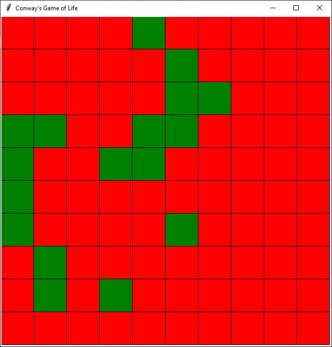

# Celular-Automata

Cellular-Automata is a base system for the many models of automata theory.
It includes a basic window for 2D visualization, and an easy to use rule making system.



## Rule making

The rules for Conway's game of life are very easy to implement.
The only thing you should be aware of is to never change the state of the cell manually.
Change only the newState.

```python
@staticmethod
def rules(cell):
    if cell.get_state() == "alive" and (cell.count_neighbours("alive") < 2 or cell.count_neighbours("alive") > 3):
        cell.new_state("dead")
    elif cell.get_state() == "dead" and cell.count_neighbours("alive") == 3:
        cell.new_state("alive")
```

## Colouring the cells

Changing the different colours of the cells based on their state is easy, you just change the following hashmap.

```python
colors = {"alive": "green", "dead": "red"}
```
